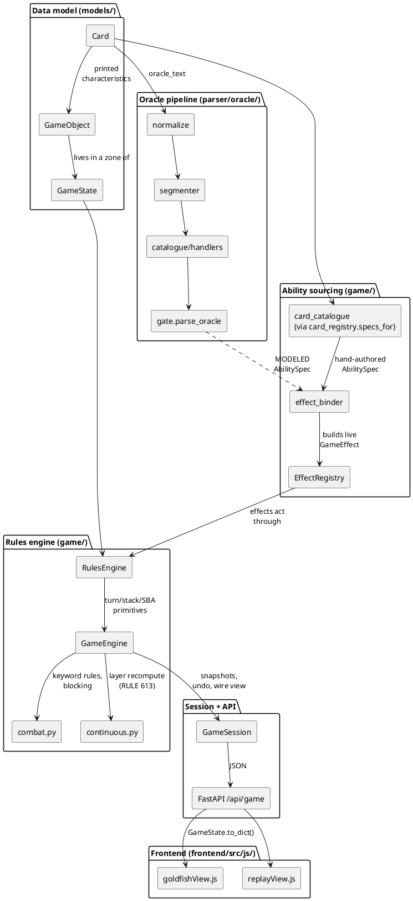
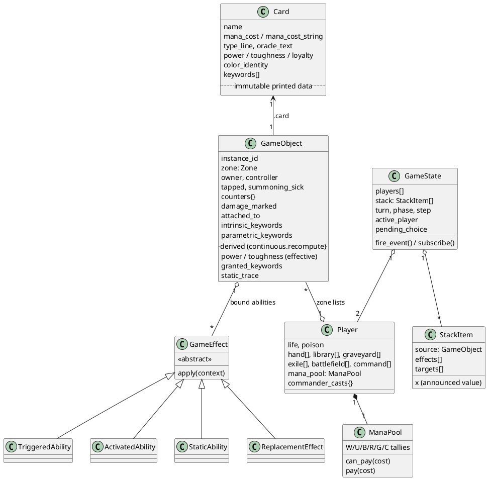
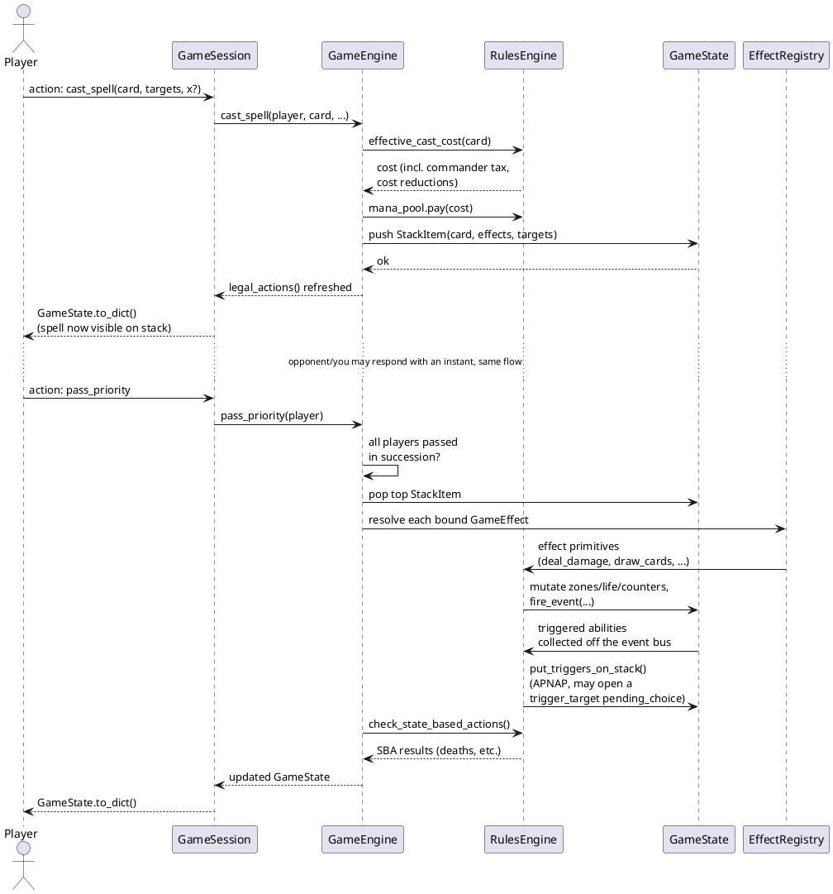
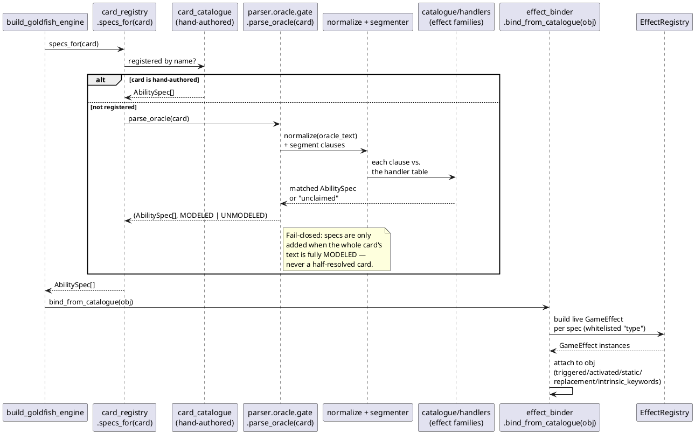
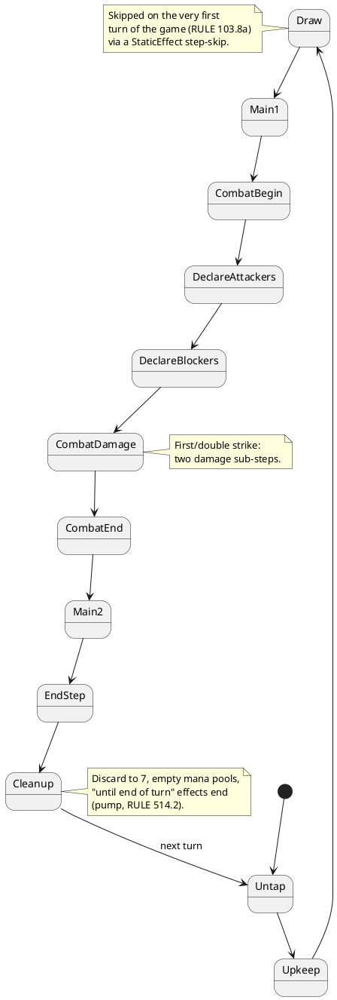

# Architecture Diagrams (PlantUML)

Visual companions to the prose design docs in this folder. These render with
any PlantUML tool (the [PlantUML VS Code extension](https://marketplace.visualstudio.com/items?itemName=jebbs.plantuml),
`plantuml.jar`, or the public plantuml.com server) — paste a fenced block's
contents between `@startuml`/`@enduml` into a renderer, or point a
PlantUML-aware Markdown previewer at this file directly.

Kept intentionally small and coarse-grained: these are orientation diagrams
for someone new to the codebase, not a generated/exhaustive UML dump. When
the shape of a module changes enough that a diagram actively misleads,
update the relevant one here — don't let it silently rot.

---

## 1. Component overview

The layered flow from the CLAUDE.md "Architecture & data flow" section, as a
component diagram. Solid arrows are direct calls/imports; the oracle-text
pipeline (dashed) is the alternate path for cards with no hand-authored
catalogue entry.

---

## 2. Core data-model classes

Not every field — just the ownership/containment shape that trips people up
first: a `Card` is immutable print data, shared/cloned cheaply across
copies; a `GameObject` is one mutable in-play instance of a `Card`;
`GameState` owns every zone across both players plus the stack and event bus.

---

## 3. Sequence: casting a spell (interactive stack, RULE 608)

Shows the "leaves the spell on the stack" model (docs/07) rather than
auto-resolve: an instant can be cast in response before the original
resolves.

---

## 4. Sequence: oracle-text → effect (bind-on-load)

The compiler pipeline behind "card text becomes behaviour without a
hand-authored entry" (docs/09). Runs once per object at game setup;
`card_registry.specs_for` is the fork between the two sources.

---

## 5. State: a turn (RULE 500)

`game/phases.py`'s `TurnSequence` walked by the engine; skip effects (docs/07
PART 8) can bypass a step entirely (e.g. an extra-combat effect, or "skip
your draw step").

Every step opens a priority window (RULE 500.4, solo goldfish auto-resolves
it; `pass_priority(player)` is the interactive primitive, docs/07 PART 1 and
`docs/implementation-state/Done_Backend.md` "Game Engine (Phase 3)").
